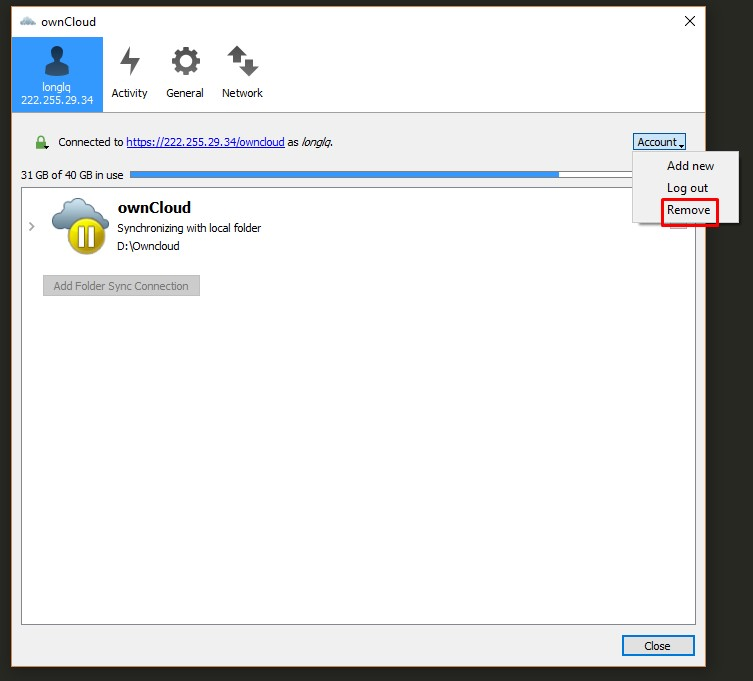
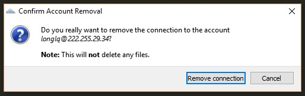
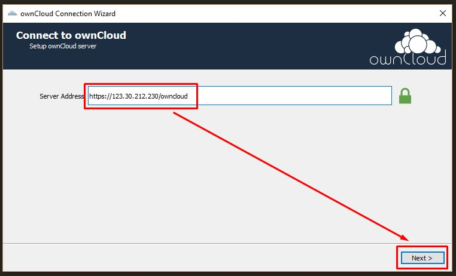
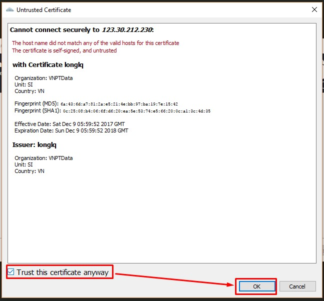
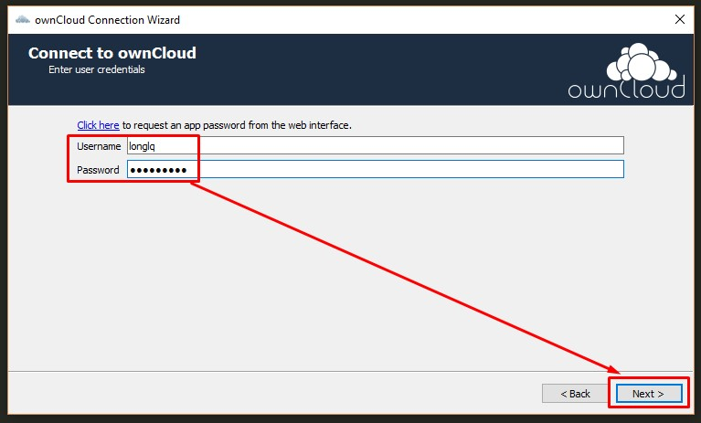
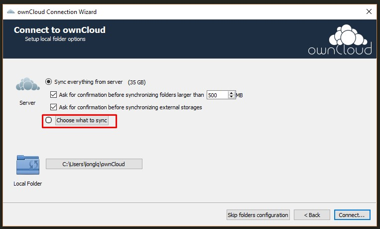
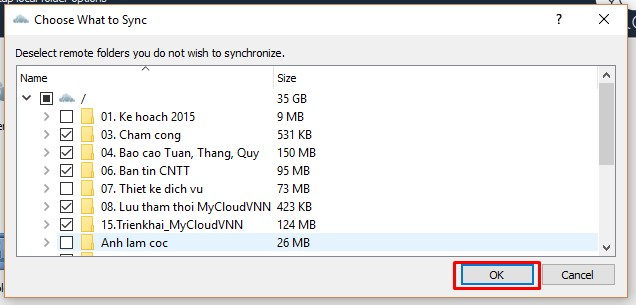
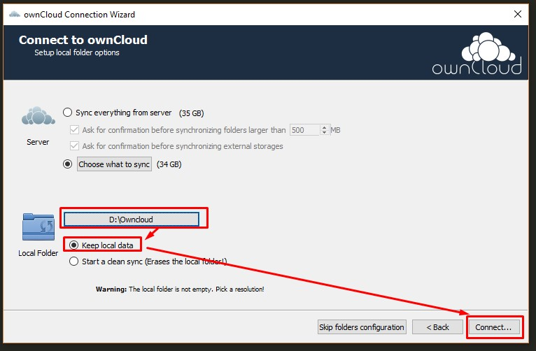
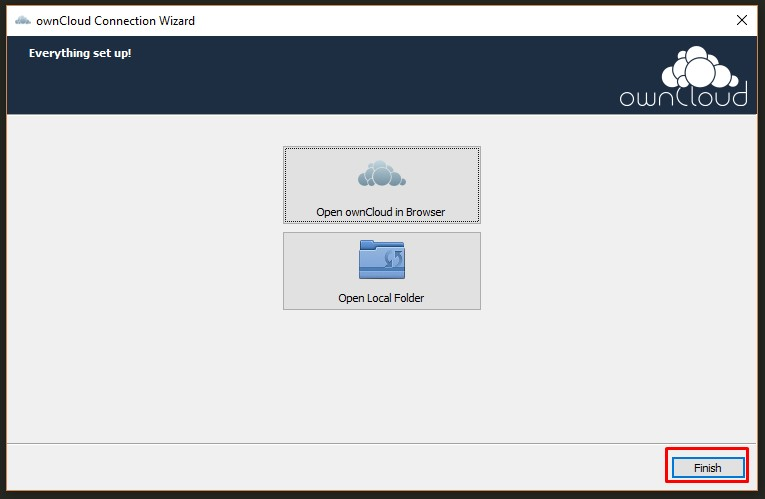

# Hướng dẫn chuyển kết nối sang Server OwnCloud mới.
Hướng dẫn này được thực hiện trên OS Windows

### 1. Mở ứng dụng OwnCloud Desktop,chọn Server OwnCloud đang sử dụng, vào mục Account -> Remove

### 2. Xác nhận gỡ bỏ kết nối tới server cũ

### 3. Thực hiện add kết nối tới server mới, có địa chỉ `https://123.30.212.230/owncloud`

### 4. Tích chọn vào mục "Trust this Certificate anyway"

### 5. Khai báo tài khoản Owncloud đang sử dụng

### 6. Chọn "Choose what to sync"

### 7. Lựa chọn đồng bộ các thư mục đang sử dụng

### 8. Đặt thư mục OwnCloud trùng với thư mục đang sử dụng, chọn "Keep local data"

### 9. Chọn "Finish"

