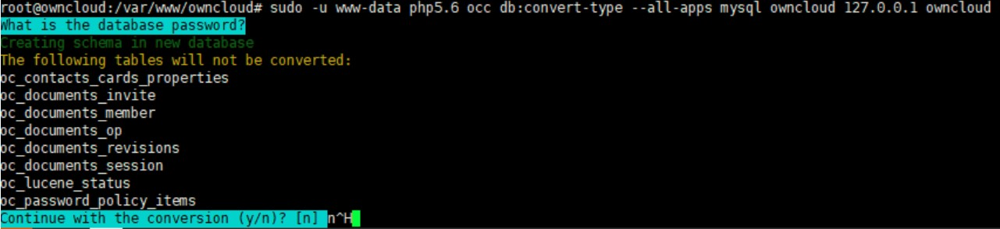

# Hướng dẫn migrate và upgrade Owncloud từ 7.0.4 -> 10.0.4
## Đầu bài:
Server cũ sử dụng OS Ubuntu 12.04 đang chạy Owncloud phiên bản 7.0.4. Yêu cầu dựng 1 hệ thống Owncloud mới, với phiên bản mới nhất, và di chuyển các dữ liệu từ hệ thống cũ sang, toàn bộ user, quyền đều phải được giữ nguyên.

## Giải pháp:
Server mới sử dụng OS Ubuntu 16.04, cài đặt Owncloud 7.0.4 (giống server cũ), sau khi migrate data từ server cũ sang, sẽ tiến hành upgrade phiên bản theo lộ trình như sau:

7.0.4 -> 7.0.15 -> 8.0.16 -> 8.1.12 -> 8.2.11 -> 9.0.10 -> 9.1.6 -> 10.0.4

## 1. Cài đặt OwnCloud 7.0.4 trên Ubuntu 16.04
### 1.1. Cài đặt repo để cài đặt php5.6 và các package liên quan (phiên bản php cho owncloud 7.0.4)
```sh
apt-get install software-properties-common -y
add-apt-repository ppa:ondrej/php
apt-get update
apt-get install php7.0 php5.6 php5.6-mysql php-gettext php5.6-mbstring php-xdebug libapache2-mod-php5.6 libapache2-mod-php7.0 php5.6-zip php5.6-XMLwriter php5.6-GD php5.6-ldap ldap-utils curl php5.6-curl smbclient php5.6-smbclient
apt-get install php5.6 php5.6-mysql
apt-get install php5.6-gd php5.6-json php5.6-curl php5.6-intl php5.6-mcrypt php5.6-imagick
```

### 1.2. Cài đăt web server và DB
```sh
apt-get install apache2
apt-get install mysql-server
```

### 1.3. Sau khi cài đặt xong mysql, chạy lệnh `mysql_secure_installation` và thực hiện như sau
```sh
Set root password? [Y/n] y
Remove anonymous users? [Y/n] y
Disallow root login remotely? [Y/n] y
Remove test database and access to it? [Y/n] y
Reload privilege tables now? [Y/n] y
```

### 1.4. Download package của owncloud 7.0.4, giải nén và phân quyền
```sh
wget http://ftp.icm.edu.pl/packages/owncloud/owncloud-7.0.4.tar.bz2
tar -xvf owncloud-7.0.4.tar.bz2 -C /var/www/owncloud
chown www-data:www-data -R /var/www/owncloud
```

### 1.5. Đứng trên server cũ, sync toàn bộ thư mục owncloud của Server cũ sang server mới (chú ý 2 server đều phải cài rsync)
```sh
rsync -avz -e "ssh -p 7225" /var/www/owncloud/* new_host:/var/www/owncloud/
```

### 1.6. Đứng trên server cũ, sync toàn bộ thư mục data của Server cũ sang server mới (chú ý 2 server đều phải cài rsync)
```sh
rsync -avz -e "ssh -p 7225" /var/www/ftp/data/* new_host:/var/www/owncloud/data/
```

### 1.7. Chỉnh sửa lại file config.php trong /var/www/owncloud/config với IP của Server mới

```sh
<?php
$CONFIG = array (
  'instanceid' => 'oc35c4d45b53',
  'passwordsalt' => 'd2ef02c23f4c0e3ac4ef34774993df',
  'secret' => 'e017c98424ba8bf28841e8aaeb4fe03372f4ea86a210b23a415a708d7eaa06df8bc168ecdf522ba22208b33c0b5e274e',
  'trusted_domains' =>
  array (
    0 => 'ip_address',
  ),
  'datadirectory' => '/var/www/owncloud/data',
  'overwrite.cli.url' => 'http://ip_address/owncloud',
  'dbtype' => 'sqlite3',
  'version' => '7.0.4.2',
  'installed' => true,
);
```

## 2. Upgrade Server Owncloud mới từ 7.0.4 lên 10.0.4
Việc upgrade được thực hiện theo lộ trình sau:

7.0.4 -> 7.0.15 -> 8.0.16 -> 8.1.12 -> 8.2.11 -> 9.0.10 -> 9.1.6 -> 10.0.4

Hướng dẫn sau sẽ hướng dẫn việc upgrade từ 7.0.4 -> 8.0.16, các phiên bản kế tiếp thực hiện tương tự

### 2.1 Stop dịch vụ apche2
```sh
service apache2 stop
```

### 2.2. Backup database
Ở server cũ, tôi sử dụng SQLite nên sẽ backup SQLite, nếu các bạn sử dụng MySQL thì sử dụng tập lệnh mysqldump để backup
```sh
sqlite3 /var/www/owncloud/data/owncloud.db .dump > /var/www/owncloud/owncloud_sqlite_704.bak
```

### 2.3. Move thư mục owncloud hiện thời sang owncloud_704
```sh
mv /var/www/owncloud /var/www/owncloud_704
```

### 2.4 Download phiên bản OwnCloud 8.0.16, các phiên bản owncloud có thể down ở link `http://ftp.icm.edu.pl/packages/owncloud`
```sh
wget http://ftp.icm.edu.pl/packages/owncloud/owncloud-8.0.16.tar.bz2
```

### 2.5. Giải nén và phân quyền
```sh
tar -xvf owncloud-8.0.16.tar.bz2 -C /var/www/
chown -R www-data:www-data /var/www/owncloud/
```

### 2.6. Copy lại file config.php vào thư mục /var/owncloud/config
```sh
cp -p /var/www/owncloud_704/config/config.php /var/www/owncloud/config/
```

### 2.7. Copy lại thư mục data/
Ở Server mới, thư mục data được mount vào ổ /dev/sdb, do đó tôi sẽ mount lại ổ này vào data. Nếu các bạn không dùng phương pháp này thì move lại thư mục data/ từ /var/owncloud_704/ sang thư mục /var/owncloud
```sh
mkdir /var/www/owncloud/data
umount /dev/sdb
mount /dev/sdb /var/www/owncloud/data
```

### 2.8. Dùng tập lệnh occ để kiểm tra trạng thái phiên bản hiện tại
```sh
cd /var/www/owncloud/
sudo -u www-data php5.6 /var/www/owncloud/occ status
```
Kết quả:
```sh
  - installed: true
  - version: 8.0.16
  - versionstring: 8.0.16
  - edition: Community
```

### 2.9. Chuyển Server về trạng thái maintenance và khởi động lại apache2
```sh
sudo -u www-data php5.6 /var/www/owncloud/occ maintenance:mode --on
service apache2 restart
```

### 2.10. Tiến hanh upgrade phiên bản Owncloud
```sh
sudo -u www-data php5.6 /var/www/owncloud/occ upgrade
```
Nếu thông báo gặp vấn đề trong quá trình backup, kiểm tra log trong /vaw/www/owncloud/data/owncloud.log để tìm nguyên nhân và khắc phục, sau đó thực hiện upgrade lại.
Nếu thông báo thành công, thực hiện bước tiếp theo.

### 2.11. Khởi động lại apache2.
```sh
service apache2 restart
```

### 2.12. Kiểm tra việc upgrade
Truy cập vào `https:ip_address/owncloud/status.php` để kiểm tra phiên bản mới upgrade
```sh
{"installed":true,"maintenance":false,"needsDbUpgrade":false,"version":"8.0.16","versionstring":"8.0.16","edition":"Community","productname":"ownCloud"}
```

## Thực hiện tương tự để upgrade các phiên bản kế tiếp.

## Trên Server cũ, tôi sử dụng SQLite, sau khi migrate sang server mới, tôi muốn chuyên sang sử dụng MySQL. Tôi sẽ sử dụng công cụ db:convert-type của occ để thực hiện việc này.

Lưu ý: bản  stable cuối cùng của công cụ này là bản 9.1.6, các phiên bản sau có lỗi khi convert, do đó cần thực hiện convert DB trước khi upgrade lên 10.0. Việc backup DB và thư mục Owncloud phải thực hiện liên tục mỗi khi upgrade, vì Owncloud không hỗ trợ downgrade phiên bản.

### 2.13. Tạo MySQL DB cho Owncloud trên Server mới
```sh
mysql -u root -p

CREATE DATABASE owncloud;
GRANT ALL ON owncloud.* to 'owncloud'@'localhost' IDENTIFIED BY 'Welcome123';
FLUSH PRIVILEGES;
exit;
```

### 2.13. Convert DB từ SQLite sang MySQL
```sh
cd /var/www/owncloud/
sudo -u www-data php5.6 /var/www/owncloud/occ db:convert-type --all-apps mysql owncloud 127.0.0.1 owncloud
```
Nhập password của DB MySQL và thực hiện theo hướng dẫn



### 2.14. Khởi động lại apache2.
```sh
service apache2 restart
```

### 2.15. Kiểm tra việc convert
Kiểm tra file /var/www/owncloud/config/config.php đã chuyển cấu hình sang mysql
```sh
<?php
$CONFIG = array (
  'instanceid' => 'oc35c4d45b53',
  'passwordsalt' => 'd2ef02c23f4c0e3ac4ef34774993df',
  'secret' => 'e017c98424ba8bf28841e8aaeb4fe03372f4ea86a210b23a415a708d7eaa06df8bc168ecdf522ba22208b33c0b5e274e',
  'trusted_domains' =>
  array (
    0 => 'ip-address',
  ),
  'datadirectory' => '/var/www/owncloud/data',
  'overwrite.cli.url' => 'http://ip-address/owncloud',
  'dbtype' => 'mysql',
  'version' => '10.0.4.4',
  'installed' => true,
  'maintenance' => false,
  'loglevel' => 2,
  'ldapIgnoreNamingRules' => false,
  'trashbin_retention_obligation' => 'auto',
  'dbname' => 'owncloud',
  'dbhost' => '127.0.0.1',
  'dbuser' => 'owncloud',
  'dbpassword' => 'Welcome123',
);

```

Hệ thống mới đã chuyển sang sử dụng MySQL DB.

Tham khảo:

[1] - https://central.owncloud.org/t/migrate-owncloud-server-7-0-4-on-ubuntu-12-04-to-owncloud-server-9-on-ubuntu-16-04/2855/

[2] - https://www.rosehosting.com/blog/how-to-install-owncloud-7-on-an-ubuntu-14-04-vps/

[3] - https://www.2daygeek.com/owncloud-migration-linux/#

[4] - https://www.2daygeek.com/how-to-migrate-owncloud-from-sqlite-to-mysql-database/

[5] - https://doc.owncloud.org/server/9.1/admin_manual/maintenance/upgrade.html

[6] - https://owncloud.org/blog/upgrading-owncloud-on-debian-stable-to-official-packages/

[7] - https://doc.owncloud.org/server/9.1/admin_manual/maintenance/manual_upgrade.html

[8] - https://doc.owncloud.org/server/9.1/admin_manual/maintenance/upgrade.html

[9] - https://doc.owncloud.org/server/8.0/admin_manual/configuration_database/db_conversion.html

[10] - https://github.com/owncloud/core/issues/28223